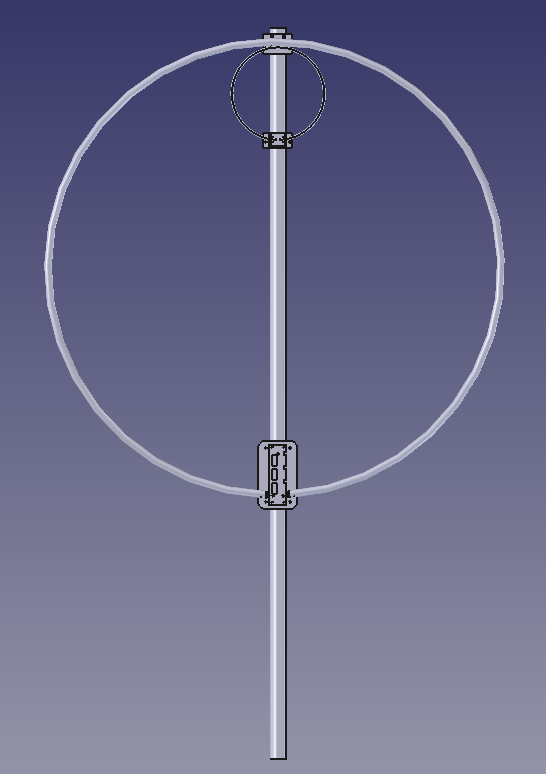

# Magnetic Loop Antenna

Magnetic loop antenna for HAM radio.



Designed using FreeCAD, STL files for printing can be found in `stl` directory.

Assembly details are written in Russian in [blog post](https://blog.tataranovich.com/2026/03/magnetic-loop-antenna.html). Use Google translate if needed.

## Antenna Tuner

Simple python script to adjust antenna controller settings to match frequency change in `rtl_tcp` backend.

```bash
sudo apt-get update
sudo apt-get install -y rtl-sdr

sudo mkdir /opt/magloop
sudo useradd -r -d /opt/magloop -s /usr/sbin/nologin -G plugdev magloop
sudo install -o root -m 644 magloop-tuner.py /opt/magloop/
sudo install -o root -m 644 magloop-tuner.service /etc/systemd/system/
sudo systemctl daemon-reload
sudo systemctl enable --now magloop-tuner.service
```